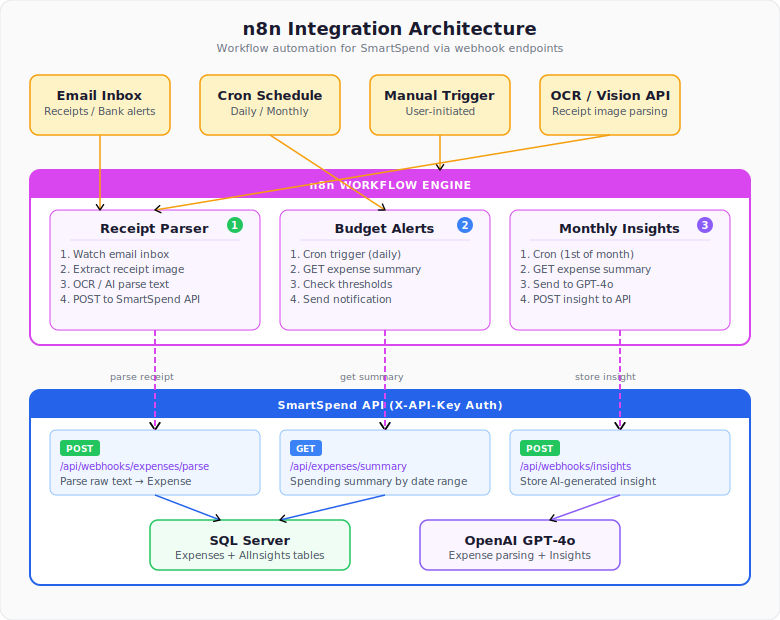

# SmartSpend

An AI-powered expense tracker built with .NET 10 and Angular 17.

## Architecture



## Tech Stack

| Layer | Technology |
|-------|------------|
| Frontend | Angular 17 |
| Backend | .NET 10 Web API |
| Database | SQL Server + EF Core |
| AI | OpenAI GPT-4o |
| Auth | JWT Bearer Tokens |
| Testing | xUnit + FluentAssertions |

## Project Structure

```
SmartSpend/
├── SmartSpend.API/            # Controllers, middleware, Program.cs
├── SmartSpend.Core/           # Entities, DTOs, interfaces
├── SmartSpend.Infrastructure/ # DbContext, services, migrations
├── SmartSpend.Tests/          # Unit and integration tests
└── smartspend-ui/             # Angular frontend (Sprint 2)
```

## Development Agents

This project uses specialized Claude Code agents per layer:

| Agent | Folder | Focus |
|-------|--------|-------|
| **Backend** | `SmartSpend.API/` | Controllers, routing, auth middleware |
| **Domain** | `SmartSpend.Core/` | Entities, DTOs, interfaces |
| **Data/Services** | `SmartSpend.Infrastructure/` | EF Core, services, migrations |
| **QA** | `SmartSpend.Tests/` | Unit tests, TDD workflow |
| **Frontend** | `smartspend-ui/` | Angular components, state (Sprint 2) |
| **AI** | - | OpenAI integration, insights (Sprint 3) |

Each folder contains a `CLAUDE.md` with role-specific instructions.

## Development Methodology

**Test-Driven Development (TDD)**

1. **RED** - Write a failing test first
2. **GREEN** - Write minimal code to pass
3. **REFACTOR** - Improve while keeping tests green

## Quick Start

```bash
# Build
dotnet build

# Run API
dotnet run --project SmartSpend.API

# Run tests
dotnet test
```

## Task Board

Project kanban: https://github.com/users/kennetharcenio/projects/2

## n8n Integration



SmartSpend integrates with [n8n](https://n8n.io) for workflow automation:

| Workflow | Trigger | What it does |
|----------|---------|-------------|
| **Receipt Parser** | Email inbox watch | Extracts expense data from receipts via OCR/AI, auto-creates expenses |
| **Budget Alerts** | Daily cron | Checks spending against thresholds, sends Slack/email notifications |
| **Monthly Insights** | 1st of month | Aggregates spending, generates GPT-4o insights, stores in database |

Webhook endpoints use API key auth (`X-API-Key` header) for service-to-service communication.

## API Endpoints

| Method | Endpoint | Description |
|--------|----------|-------------|
| POST | `/api/auth/register` | Register new user |
| POST | `/api/auth/login` | Login, returns JWT |
| GET | `/api/expense` | Get user expenses |
| POST | `/api/expense` | Create expense |
| PUT | `/api/expense/{id}` | Update expense |
| DELETE | `/api/expense/{id}` | Delete expense |
| POST | `/api/webhooks/expenses/parse` | Parse receipt text into expense (n8n) |
| GET | `/api/expenses/summary` | Get spending summary by date range (n8n) |
| POST | `/api/webhooks/insights` | Store AI-generated insight (n8n) |

## Database Tables

- **Users** - User accounts with hashed passwords
- **Categories** - Default + custom expense categories
- **Expenses** - User expenses with AI parsing flag
- **AIInsights** - Cached monthly spending insights

## License

MIT
